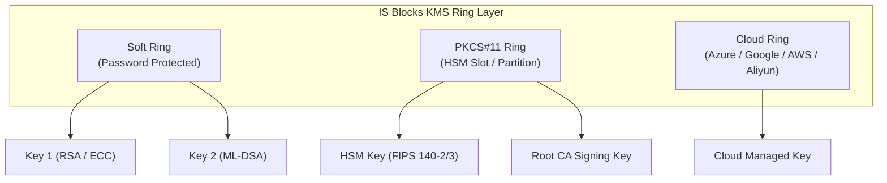

# Ring Management

This section describes the concept, administration, and lifecycle management of **Key Rings** in the IS Blocks KMS system.

## What is a Key Ring?

A **Key Ring** (or Keyring) is a logical container and security boundary used to group, isolate, and manage cryptographic keys. Every key created in IS Blocks KMS resides within a specific ring. 

A Key Ring defines:
* **The Cryptographic Backend:** Determines where keys are stored and where cryptographic operations take place (e.g., software keystores, on-premise Hardware Security Modules (HSMs), or Cloud Key Management Services).
* **Access & Authentication Controls:** Encapsulates the credentials, slot PINs, or cloud identities required to access the underlying keys.
* **Operational Status:** Allows administrators to globally activate or deactivate all keys within a ring instantly.

---

## Supported Ring Types

IS Blocks KMS supports both local and cloud-based cryptographic keystores:

| Ring Type | System Identifier | Storage Backend | Required Configuration Attributes |
| :--- | :--- | :--- | :--- |
| **Soft** | `Ring_Soft` | Encrypted software keystore | Ring Name, Ring Password |
| **PKCS#11** | `Ring_PKCS11` | Hardware Security Module (HSM) | Ring Name, Library path (`.so` / `.dll`), Slot ID / Number, Slot Password / PIN |
| **Azure** | `Ring_Azure` | Azure Key Vault | Ring Name, Tenant ID, Vault Name, Client ID, Secret |
| **Google** | `GoogleRing` | Google Cloud KMS | Ring Name, Project ID, Location, KeyRing ID, Service Account credentials |
| **Alibaba** | `AliyunRing` | Alibaba Cloud KMS | Ring Name, Region ID, Access Key ID, Access Key Secret |

---

## Ring Administration Workflows

### 1. Creating a Soft Key Ring
Soft rings store cryptographic keys in software, protected by a master passphrase. They are suitable for development, testing, and environments where physical HSMs are not required.

1. Log in to the IS Blocks KMS Dashboard.
2. Navigate to **KMS** $\rightarrow$ **Rings** from the left-hand navigation menu.
3. Click the **Add** (`+`) button.
4. Fill in the required fields:
   * **Ring Name:** Enter a unique, descriptive name (e.g., `Dev_Soft_Ring`).
   * **Type:** Select **Soft** (`Ring_Soft`).
   * **Password:** Enter the protection password.
   * **Confirm Password:** Re-enter the password for confirmation.
5. Click **Save**.

---

### 2. Creating a PKCS#11 HSM Ring
PKCS#11 rings connect IS Blocks KMS directly to physical or network HSMs (such as Utimaco CryptoServer/SecurityServer, Thales Luna, or Thales ProtectServer) to provide FIPS 140-2/3 Level 3+ key isolation.

1. Log in to the IS Blocks KMS Dashboard and open **KMS** $\rightarrow$ **Rings**.
2. Click **Add** (`+`).
3. Fill in the required configuration:
   * **Ring Name:** Enter a descriptive identifier (e.g., `Production_HSM_Slot1`).
   * **Type:** Select **PKCS#11** (`Ring_PKCS11`).
   * **Password / PIN:** Enter the HSM partition User PIN or slot password.
   * **Confirm Password:** Re-enter the partition PIN.
   * **Library:** Select the registered PKCS#11 library from the dropdown or provide the absolute path to the vendor driver library (e.g., `/usr/lib/libCryptoki2_64.so` or `C:\Program Files\SafeNet\LunaClient\cryptoki.dll`).
   * **Slot ID / Number:** Specify the physical or logical HSM slot number (use vendor CLI utilities like `cputil` or `lunacm` to identify slot numbers).
4. Click **Save**.

---

### 3. Creating a Cloud KMS Ring (e.g., Azure Key Vault)
1. In the **Rings** view, click **Add** (`+`).
2. Select the cloud provider type (e.g., **Azure** / `Ring_Azure`).
3. Enter the Ring Name and cloud authentication parameters:
   * **Tenant ID:** The Microsoft Entra ID / Azure Tenant GUID.
   * **Vault Name:** The name of the Azure Key Vault instance.
   * **Client ID:** The Application / Service Principal Client ID with permissions to manage keys.
4. Click **Save**.

---

### 4. Viewing Keys within a Ring
To view and manage the cryptographic keys stored inside a specific ring:
1. Navigate to **KMS** $\rightarrow$ **Rings**.
2. Locate the target ring in the table.
3. Click the **Three Dots Menu** (`⋮`) in the Actions column and select **Keys**.
4. You will be redirected to the Keys view filtered specifically for that ring, where you can generate, inspect, or export public keys.

---

### 5. Activating and Deactivating a Ring
Every ring has an **Active / Inactive** toggle status switch:
* **Active (`active: "1"`):** Keys within the ring are accessible and available for cryptographic operations (key generation, CSR signing, encryption, decryption, certificate issuance).
* **Inactive (`active: ""`):** The ring is suspended. All signing and cryptographic operations attempting to use keys from this ring are immediately blocked by the KMS controller without deleting key data.

**To toggle activation status:**
1. Open **KMS** $\rightarrow$ **Rings**.
2. Toggle the **Status** switch next to the desired ring.
3. The system will issue a confirmation notification indicating that the status has been updated.

---

### 6. Editing a Ring
1. Open **KMS** $\rightarrow$ **Rings**.
2. Click the **Three Dots Menu** (`⋮`) and select **Edit**.
3. You can update:
   * Ring Name
   * Password / PIN (re-enter both fields)
   * Library path and Slot ID (for PKCS#11 rings)
   * Cloud credentials
4. Click **Save**.

:::warning Important: Modifying Slot ID or Library
Changing the `Slot ID` or `Library` path of an existing PKCS#11 ring points the ring to a different HSM partition or driver. If changed incorrectly, keys previously associated with this ring will become inaccessible.
:::

:::note Password Retrieval
For security reasons, ring passwords and HSM PINs are write-only and cannot be retrieved or exported via the UI or API.
:::

---

### 7. Deleting a Ring
Deleting a ring removes its availability in the KMS and sets the ring and its associated keys to deleted state (`Delete_Ring` / `Delete_Key`).

1. Open **KMS** $\rightarrow$ **Rings**.
2. Click the **Three Dots Menu** (`⋮`) and select **Delete**.
3. Confirm the deletion dialog.

---

## Troubleshooting Ring Operations

### Common Issues & Resolutions

| Issue | Possible Cause | Recommended Resolution |
| :--- | :--- | :--- |
| **PKCS#11 Library Load Failure** | Driver file not found or incompatible architecture (32-bit vs 64-bit). | Verify the absolute path to the `.so` or `.dll` file. Ensure the KMS server process has read permissions for the library file and that system dependencies (e.g., C runtime) are installed. |
| **Invalid Slot ID / Slot Not Found** | The HSM slot number changed after a daemon restart or card re-indexing. | Run the vendor diagnostic utility (e.g., `pkcs11-tool --list-slots`, `lunacm`, or `csadm`) to confirm the current active slot ID, then update the ring configuration. |
| **PKCS#11 PIN Incorrect / User Locked** | Wrong PIN entered or HSM partition locked due to too many failed attempts. | Verify the partition password. If locked, log into the HSM administration interface as Security Officer (SO) to unlock the user PIN. |
| **Cryptographic Operation Denied / Key Not Found** | The ring containing the target key is deactivated. | Check the **Status** toggle in the Rings table and switch the ring to **Active**. |
| **Cloud Authentication Failed (Azure / GCP / AWS)** | Expired client secret, incorrect tenant ID, or insufficient IAM role permissions. | Verify that the Service Principal / Service Account has `Key Management Officer` or `Key Vault Crypto User` roles assigned and that network firewall rules allow egress to cloud endpoints. |
