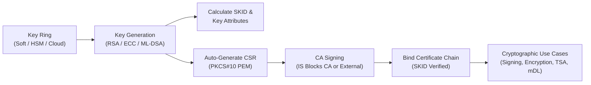

# Key Management

This section describes the cryptographic key lifecycle, algorithms, and administration procedures in the IS Blocks KMS system.

## Overview

In IS Blocks KMS, a **Key** is the fundamental cryptographic unit. Keys are generated, stored, and managed within a designated **Key Ring** (Software keystore, PKCS#11 HSM partition, or Cloud KMS).

When an asymmetric key pair is generated, the system automatically:
1. Generates the public/private key pair inside the selected storage provider or HSM token.
2. Derives the corresponding signature algorithm and calculates the **Subject Key Identifier (SKID)**.
3. Automatically generates a standard **Certificate Signing Request (CSR)** in PEM format matching the provided Subject DN.

---

## Supported Algorithms and Key Types

IS Blocks KMS supports classic asymmetric cryptography, modern elliptic curves, NIST post-quantum cryptographic standards, and symmetric ciphers:

| Category | Algorithm / Family | Supported Key Lengths / Curves | Primary Cryptographic Purpose |
| :--- | :--- | :--- | :--- |
| **Post-Quantum (NIST FIPS 204)** | **ML-DSA** *(Dilithium)* | `ML-DSA-44`, `ML-DSA-65`, `ML-DSA-87` | Quantum-resistant digital signatures & certificate issuance |
| **Elliptic Curve (ECC)** | **ECDSA (NIST Curves)** | `ECsecp256r1` (P-256), `ECsecp384r1` (P-384), `ECsecp521r1` (P-521) | High-performance digital signing, TLS, and eMRTD/eID |
| **RSA** | **RSA** | `2048 bits`, `4096 bits` | General-purpose PKI, TLS server/client, digital signing |
| **Symmetric** | **AES** | `AES-256`, `AES-512` | High-throughput data encryption & key wrapping |

---

## Key Management in the Dashboard

### 1. Generating a New Key

To create a new key in the KMS:

1. Log in to the IS Blocks KMS Dashboard.
2. Navigate to **KMS** $\rightarrow$ **Keys** from the left-hand navigation menu.
3. In the **Select Ring** dropdown at the top, select the target Key Ring where the key should reside.
4. Click the **Add** (`+`) button.
5. Fill in the key generation parameters:
   * **Name:** A friendly internal name for identification in KMS (e.g., `tls-signing-key-01`).
   * **Label:** The cryptographic label (maps directly to `CKA_LABEL` in PKCS#11 HSM systems).
   * **Subject DN:** The Distinguished Name formatted as standard RDNs (e.g., `CN=Signing Service, O=IS Blocks, C=SE`).
   * **Algorithm:** Select the desired algorithm from the dropdown (e.g., `ECsecp256r1`, `RSA4096`, or `ML-DSA-65`).
6. Click **Add**.

:::note Automatic CSR Creation
Upon key generation, IS Blocks KMS automatically produces an initial PKCS#10 Certificate Signing Request (CSR). You can copy this CSR directly from the key details to submit to an external or internal Certificate Authority.
:::

---

### 2. Inspecting and Editing Key Details

To view properties or update metadata for an existing key:

1. Open **KMS** $\rightarrow$ **Keys** and select the appropriate Ring.
2. In the Keys table, click the **Three Dots Menu** (`⋮`) next to the key and select **Edit**.
3. The Key Details view provides three main management panels:

#### Panel 1: Key Properties & Identifiers
* View and copy the **Ring ID** (UUID) and **Key ID** (UUID). These identifiers are required when calling KMS cryptographic APIs for signing, decryption, or verification.

#### Panel 2: Certificate Chain & CSR
* **Subject DN:** View or modify the Subject Distinguished Name.
* **Certificate Signing Request (CSR):** View, export, or copy the PEM-encoded CSR generated for this key.
* **Certificate Chain:** Paste an issued X.509 certificate or full PEM certificate chain.

:::important Certificate Validation & SKID Matching
When importing or updating a Certificate Chain:
1. The KMS validates the certificate syntax and chain integrity.
2. The KMS verifies that the **Subject Key Identifier (SKID)** in the end-entity certificate matches the public key's calculated SKID. If the keys do not match, the import is rejected to prevent mismatched certificate-key pairs.
:::

#### Panel 3: Description & Custom Notes
* Add operational descriptions, usage policies, or contact details for the key.

4. Click **Update** to save the changes.

---

### 3. Archiving and Deleting a Key

When a key reaches the end of its lifecycle or is deprecated:

1. Open **KMS** $\rightarrow$ **Keys** and select the key's Ring.
2. Click **Edit** on the target key.
3. In the action button group at the bottom, click **Archive**.
4. Confirm the archiving dialog.

Archiving marks the key as inactive and sets its state to `Delete_Key`, preventing future cryptographic operations while maintaining audit log history.

---

## Cryptographic Operations via API

Once a key is generated, applications and microservices can execute cryptographic operations via the REST API using the `keyId` and `ringId`.

### Common API Operations:
* **Digital Signing (`POST /api/v1/keyring/key`):** Sign raw data hashes or payloads using RSA, ECDSA, or ML-DSA.
* **CSR Signing (`POST /api/v1/keyring/key` with `format=csr`):** Generate signed certificate requests.
* **Data Encryption & Decryption (`POST /api/v1/keyring/key/{keyId}/encrypt`):** Encrypt payload data with symmetric or asymmetric keys.
* **Hardware Random Number Generation (`POST /api/v1/keyring/rng`):** Request cryptographically secure random bytes directly from the underlying HSM hardware RNG.

---

## Security Best Practices

* **Hardware Isolation:** For production Root CAs and high-value signing keys, always allocate keys within a `Ring_PKCS11` backed by an HSM certified to FIPS 140-2/140-3 Level 3+.
* **Label Uniqueness:** Ensure key labels (`CKA_LABEL`) are unique within each ring to prevent ambiguous lookups during PKCS#11 sessions.
* **Lifecycle Separation:** Maintain separate keys for signing, encryption, and certificate issuance rather than reusing a single key pair for multiple distinct operations.
