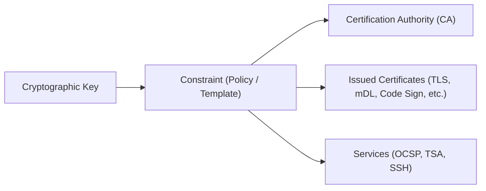

# Constraint Management

This section describes the concept, configuration, and administration of **Constraints** in the IS Blocks KMS system.

## What is a Constraint?

In IS Blocks KMS, a **Constraint** is a reusable policy, governance profile, and template that defines the exact rules, cryptographic parameters, and extension metadata applied when issuing digital certificates, creating Certificate Authorities (CAs), or provisioning services (such as OCSP responders, Time Stamping Authorities, and SSH CAs).

Instead of requiring users or applications to manually provide granular cryptographic extensions, validity intervals, and key usages for every individual request, a Constraint encapsulates these specifications into a standardized, named profile.



When a Certificate Authority or certificate request is processed, the system binds the cryptographic key with the selected Constraint identifier, automatically generating and enforcing the compliance, validity, and extension rules defined within that constraint.

---

## Constraint Types

The IS Blocks KMS system supports three primary types of constraints:

| Constraint Type | Identifier in KMS | Description | Primary Use Cases |
| :--- | :--- | :--- | :--- |
| **X.509** | `Constraint_X509` | Defines PKIX / X.509 certificate profiles and extension rules. | Root & Intermediate CAs, TLS Server/Client, Code Signing, Time Stamping, eIDAS Qualified Certificates, PSD2 certificates, and Mobile Driving Licences (mDL). |
| **SSH** | `Constraint_SSH` | Governs OpenSSH certificate authority policies and certificate signing. | Host and User SSH certificates, authorized principals, and critical login options (`force-command`, `source-address`). |
| **CVCA** | `Constraint_CVCA` | Configures Card Verifiable Certification Authority hierarchies. | ePassports (eMRTD), electronic IDs (BSI TR-03110), DVCA/IS roles, and access rights (DG3 fingerprint, DG4 iris). |

---

## Constraint Attributes and Configuration

A constraint consists of several modular sections that control cryptographic and policy attributes:

### 1. General Information
* **Name:** A descriptive unique identifier (e.g., `Constraint.IACA`, `TLS_Server_Profile`, `RootCA_Policy`).
* **Type:** The constraint standard (`Constraint_X509`, `Constraint_SSH`, `Constraint_CVCA`).
* **CA Association (`caId`):** Indicates the issuing relationship:
  * `self`: Used for Self-Signed Root CAs.
  * `external`: Used when the CA certificate is signed by an external third-party authority.
  * `CA Identifier`: References an existing internal CA on the KMS platform.
* **Signature Algorithm:** Cryptographic signature scheme, including:
  * Standard algorithms: `SHA256WithECDSA`, `SHA256WithRSA`, `SHA384WithECDSA`, `SHA512WithRSA`.
  * Post-Quantum algorithms: `ML-DSA-44-WITH-SHA512`, `ML-DSA-65-WITH-SHA512`, `ML-DSA-87-WITH-SHA512`.
* **Validity:** Configures the certificate lifespan using flexible duration units (e.g., `2y`, `365d`, `1y;6mo;3d;12h`).
* **Private Key Usage Period:** Optional specific validity timeframe during which the private key may be used for signing.

### 2. Key Usage & Identifiers (X.509)
* **Basic Key Usage:** Controls standard cryptographic purposes:
  * `Key Cert Sign` (CA certificate signing)
  * `CRL Sign` (Revocation list signing)
  * `Digital Signature` (Authentication & data integrity)
  * `Non Repudiation` / `Content Commitment`
  * `Key Encipherment`, `Data Encipherment`, `Encipher Only`, `Decipher Only`
* **Extended Key Usage (EKU):** Application-specific usage flags:
  * `SSL Server` (TLS Web Server Authentication)
  * `SSL Client` (TLS Web Client Authentication)
  * `Code Signing`
  * `Time Stamping`
  * `OCSP Signing`
  * `SPOC Server` / `SPOC Client` (Single Point of Contact for eMRTD)
  * Custom OIDs (such as `1.0.18013.5.1.2` for ISO/IEC 18013-5 mDL).
* **Key Identifiers:**
  * **Subject Key Identifier (SKI):** Uniquely identifies the public key.
  * **Authority Key Identifier (AKI):** Identifies the public key used to sign the certificate.

### 3. Subject and Issuer Details
* **Subject DN & Issuer DN:** Distinguished Name templates (e.g., `CN=..., O=IS Blocks, C=SE` or `*` for wildcards).
* **Subject Alternative Names (SAN):** Additional entity identities, including Email (`rfc822Name`), DNS Names (`dnsName`), and Directory Names (`directoryName`).
* **Issuer Alternative Names (IAN):** Alternative identifiers for the issuing authority.

### 4. Policy, Compliance & Authority Extensions
* **Basic Constraints:**
  * `isCA`: Flag determining whether the certificate belongs to a Certification Authority (`true` or `false`).
  * `pathLen`: Path length constraint limiting the depth of subordinate CAs.
* **Certificate Policies:** Policy OIDs, Certification Practice Statement (CPS) URIs, and User Notice text.
* **Authority Information Access (AIA):** Defines endpoints for Online Certificate Status Protocol (OCSP) responders and CA Issuer certificate downloads.
* **CRL Distribution Points (CDP):** URI endpoints where Certificate Revocation Lists can be fetched.
* **eIDAS & PSD2 Compliance:**
  * **QC Statements:** Qualified Certificate compliance flags (`qcCompliance`, `qcsscd` for QSCD).
  * **QC Types:** `eSignature`, `eSeal`, `Website Authentication (QWAC)`.
  * **PSD2 Attributes:** Payment Service Provider (PSP) roles (`ASPSP`, `PISP`, `AISP`), National Competent Authority (NCA) Name, and NCA ID.
  * **PKI Disclosure Statement (PDS):** URL pointing to regulatory disclosure information.

### 5. SSH and CVCA Specific Options
* **SSH Options:**
  * **Principals:** Authorized usernames (e.g., `root`, `ubuntu`, `jdoe`) or host FQDNs.
  * **Certificate Type:** `User` or `Host`.
  * **Critical Options:** Mandatory enforcement policies such as `force-command` (restricts execution to a designated script) and `source-address` (CIDR IP address restrictions).
* **CVCA Options:**
  * **Role:** `CVCA` (Country Verifying CA), `DVCA` (Document Verifier CA), or `IS` (Inspection System).
  * **Access Rights:** Read access to biometric data groups such as `DG3` (Fingerprint) and `DG4` (Iris).

---

## Managing Constraints in the Dashboard

### Creating a Constraint
1. Log in to the IS Blocks KMS Dashboard.
2. Select the **KMS** module and navigate to **Constraints** in the navigation menu.
3. Click **Add Constraint** (`+`).
4. Enter the **Constraint Name** and choose the **Type** (`X.509`, `SSH`, or `CVCA`).
5. Configure the relevant accordion sections:
   * Select the **CA Association** and **Signature Algorithm**.
   * Define the **Validity** duration.
   * Set **Key Usages**, **Subject/Issuer DNs**, **SANs**, and compliance flags as needed.
6. Click **Save** to create the constraint.

### Editing a Constraint
1. Navigate to the **Constraints** list.
2. Click on the desired constraint to open the edit panel.
3. Modify the necessary parameters (e.g., extend validity, add EKUs, or update AIA/CRL URLs).
4. Click **Update** to save the changes.

---

## JSON Representation Example

Below is an example of an X.509 Subordinate CA constraint defined in JSON format:

```json
{
  "name": "Constraint.SubCA",
  "type": "Constraint_X509",
  "attributes": {
    "caId": "self",
    "algorithm": "SHA256WithECDSA",
    "validity": "5y",
    "basicConstraintsPresent": true,
    "basicConstraints_isCA": true,
    "basicConstraints_pathLen": "0",
    "basicKeyUsage": "keyCertSign,crlSign",
    "extendedKeyUsage": "",
    "subjectKeyIdentifierPresent": true,
    "authorityKeyIdentifierPresent": true,
    "authorityInformationAccess": true,
    "authorityInformationAccess_aiaURL": "http://ocsp.isblocks.com",
    "crlDistributionPointPresent": true,
    "crlDistributionPoint": "http://crl.isblocks.com/subca.crl"
  }
}
```
