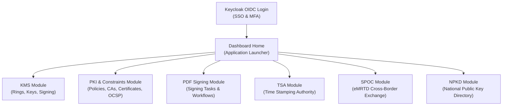

# KMS Dashboard Operations

This document describes the user interface, navigation, and basic operations of the **IS Blocks KMS Dashboard**.

## Overview

The IS Blocks KMS Dashboard is a modern, responsive web administration console built on React, Material-UI (MUI), and TanStack Query. It provides a centralized interface for administrators and security officers to manage cryptographic keys, Hardware Security Modules (HSMs), Certificate Authorities (CAs), compliance constraints, digital signing workflows, and trust services.

---

## Authentication & Access Control

The dashboard integrates with **Keycloak Identity & Access Management (IAM)** via OpenID Connect (OIDC / OAuth2):

* **Single Sign-On (SSO):** Authenticate using corporate credentials, LDAP, or Active Directory.
* **Multi-Factor Authentication (MFA):** Supports hardware security keys (FIDO2/WebAuthn), OTP authenticators, and client certificates.
* **Role-Based Access Control (RBAC):** UI elements, menus, and actions are automatically filtered according to the user's assigned roles (e.g., KMS Administrator, Security Officer, Operator, Auditor).

---

## Dashboard Home (Application Tiles)

Upon logging in, the **Home** view displays the primary application modules:

| Module Tile | Route | Description |
| :--- | :--- | :--- |
| **KMS** | `/kms/rings` | Key Ring lifecycle, software & PKCS#11 HSM keystores, key generation, and raw cryptographic signing. |
| **PKI** | `/constraints` | Public Key Infrastructure policies, X.509/SSH/CVCA constraints, Certificate Authorities, and certificate issuance. |
| **PDF** | `/pdf/tasks` | Digital PDF document signing, visual signature placement, and task queue management. |
| **TSA** | `/tsa` | RFC 3161 compliant Time Stamping Authority management and timestamp token verification. |
| **SPOC** | `/countries` | Single Point of Contact module for ePassports (eMRTD) and Country Verifying CA cross-border certificate exchange. |
| **NPKD** | `/npkd` | National Public Key Directory for ICAO Doc 9303 Master Lists and Country Signing CAs (CSCA). |

---

## User Interface & Navigation

### 1. Top Application Bar (AppBar)
* **Application Brand & Title:** Displays current active context.
* **Global Navigation:** Quick link back to the Dashboard tile launcher.
* **User Profile & Session Menu:** Located at the top-right corner; allows viewing user details (`/user-profile`), active tokens, and logging out.

### 2. Sidebar Navigation Drawer
When navigating inside a specific module (such as KMS or PKI), the collapsible left-hand drawer displays sub-sections:
* **KMS Drawer:**
  * **Rings:** Manage software, PKCS#11 HSM, and Cloud KMS keystores.
  * **Keys:** Generate and inspect asymmetric and symmetric keys.
  * **Sign:** Test and execute interactive cryptographic signature operations.
* **PKI Drawer:**
  * **Constraints:** Define and edit certificate profiles and governance rules.
  * **Certification Authorities:** Create and inspect Root CAs, Sub CAs, and external CAs.
  * **Certificates:** Search, inspect, and revoke issued digital certificates.
  * **Registration Authority:** Manage certificate enrollment workflows.
  * **OCSP:** Configure Online Certificate Status Protocol responders.

### 3. Data Tables & List Views
* **Filtering & Scoping:** For example, in the **Keys** view, use the **Select Ring** dropdown at the top to filter keys belonging to a specific keystore.
* **Status Toggles:** Immediate activation/deactivation switches (e.g., activating or deactivating a Key Ring).
* **Action Menu (`⋮`):** Every table row includes a contextual three-dot action menu providing quick access to:
  * **Edit:** Open full properties, certificate chains, or constraint settings.
  * **View Keys:** Directly jump to keys stored inside a selected ring.
  * **Archive / Delete:** Safely deprecate or remove entities with confirmation dialogs.

---

## Common Dashboard Operations

### 1. Copying Identifiers for API Integration
Many automation pipelines and microservices communicate with the KMS REST API. The dashboard allows administrators to easily copy system identifiers:
1. Open **KMS** $\rightarrow$ **Keys** and select **Edit** on a key.
2. In the **Key Properties** accordion, click the **Copy Icon** next to **Ring ID** or **Key ID** to copy the UUID to your clipboard.

### 2. Form Drawers & Real-Time Validation
* Forms feature built-in client-side validation (powered by Zod and React Hook Form).
* Mandatory fields, invalid RDN syntax (e.g., `CN=..., O=...`), and duration format errors are flagged before submission.
* Upon successful save or update, a green confirmation **Snackbar Notification** appears at the bottom of the screen.

### 3. Asynchronous State Management
The dashboard uses TanStack Query for optimistic updates and automatic background cache invalidation. When you activate a ring, issue a certificate, or edit a constraint, data across all views is refreshed without requiring a page reload.

---

## Settings and Support

* **Settings (`/settings`):** Global KMS system preferences, PKCS#11 driver discovery, and logging configurations.
* **Support (`/support`):** Access documentation links, system version information, and diagnostic exports.
